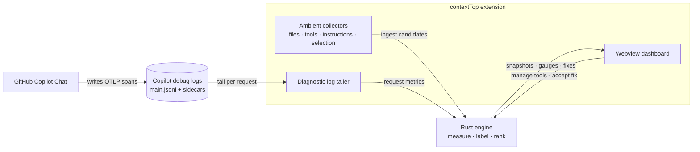
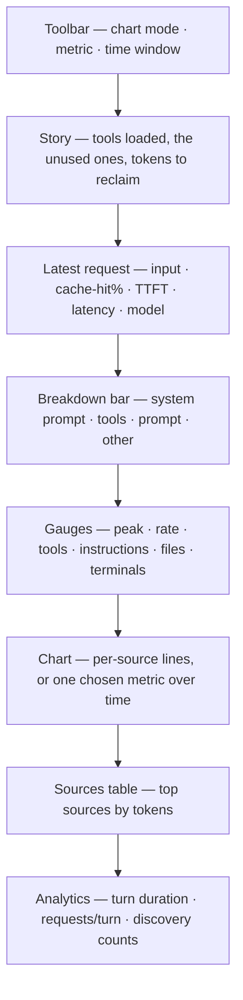

# contextTop

[](https://github.com/provenvelocity/contextTop/actions/workflows/ci.yml)

**`top`, but for your GitHub Copilot context.** A live VS Code panel that shows what is
filling your Copilot context window — system prompt, tools, files, history — in real time,
and points out what to cut before context gets expensive or noisy.

contextTop is local-first: a Rust engine does the measurement, a VS Code panel draws it,
and raw prompts or source text are never stored or sent anywhere.

## Features

- **Live context dashboard** — a streaming chart of context pressure by source, with
  gauges for tools/MCP, instruction files, open files, and terminals.
- **Request breakdown** — turns the one big "input tokens" number for a request into an
  honest split: system prompt vs. tool schemas vs. prompt vs. history/files, against the
  model's real budget.
- **Per‑request metrics** — time‑to‑first‑token, cache‑hit %, latency, output tokens,
  context growth per turn, and more — plotted over time.
- **Tool‑efficiency "story"** — names the tools loaded on every request, flags the ones
  you never call, and estimates the tokens you'd reclaim by turning them off.
- **Honest labels** — every number is tagged Observed / Estimated and Confirmed /
  Candidate, so visible material is never passed off as confirmed request context.

## How it works

contextTop watches GitHub Copilot's own local activity, measures it in a Rust engine, and
streams the result into a VS Code panel — nothing leaves your machine.



## Requirements

- **VS Code 1.96+**
- **GitHub Copilot Chat** installed and signed in (contextTop reads its local activity)

## Install

### From a prebuilt package (recommended)

Each release ships a platform‑specific `.vsix` with the engine **bundled inside** — no
source checkout or extra setup.

1. **Pick your platform:** `darwin-arm64` (Apple Silicon Mac), `darwin-x64` (Intel Mac),
   `linux-x64` (Linux), or `win32-x64` (Windows).
2. **Download** `contexttop-<platform>.vsix` from the latest
   [Release](https://github.com/provenvelocity/contextTop/releases) (attached directly),
   or from a green [CI run](https://github.com/provenvelocity/contextTop/actions)'s
   artifacts (unzip the `contexttop-<platform>-vsix` artifact).
3. **Install:**
   ```bash
   code --install-extension contexttop-<platform>.vsix
   ```
   Or in VS Code: Extensions view → `⋯` → *Install from VSIX…*.

### From source

See [`docs/TESTING.md`](docs/TESTING.md) — build the engine, compile the extension, and
press **F5**.

## Quick start

1. **Open the panel.** Reload VS Code, then open the **contextTop** view in the bottom
   Panel area (beside Terminal) — or run **contextTop: Open Fix** from the Command Palette.
2. **Use Copilot Chat as usual.** Send a prompt or run an agent task.
3. **Watch the dashboard.** Within a second the chart moves and the cards fill in:
   - The **Story** card summarizes tool cost and what's unused.
   - The chart auto‑switches to **Request** mode on your first request; use the dropdown to
     plot **all metrics**, a single metric (cache hit %, TTFT, budget %…), or the
     source **composition**.
   - The **breakdown** bar shows where your tokens actually went.

There is nothing to configure to get started.

## What you see

The panel is a stack of cards, top to bottom — the Story and Latest request cards answer
"what is costing me and what can I cut?" at a glance.



> Want real screenshots here? Capture the panel from your installed build and drop the
> images in `docs/media/`, then reference them in this section — see
> [`docs/DASHBOARD.md`](docs/DASHBOARD.md) for what each card shows.

## Extension settings

All settings live under `contextTop.*` (Settings → search "contextTop").

| Setting | Default | What it does |
| --- | --- | --- |
| `contextTop.captureLevel` | `metadata` | What may be stored locally: `off`, `metadata` (counts only), or `redacted-detail`. |
| `contextTop.enableDiagnosticLogs` | `false` | Read GitHub Copilot's local debug logs for real per‑request token/latency metrics. |
| `contextTop.dashboardLayout` | all cards | Which dashboard cards show, and in what order. |
| `contextTop.timeWindowMinutes` | `5` | Time span of the live chart (1 / 5 / 15 / 30 / 60). |
| `contextTop.warnTokens` / `contextTop.criticalTokens` | `40000` / `80000` | Amber / red threshold bands on the chart. |
| `contextTop.allowTransientContentProcessing` | `true` | Allow bounded raw content into the engine for tokenizing (never persisted). |

Retention and storage caps (`measurementRetentionDays`, `rollupRetentionDays`,
`maxStorageMiB`, …) are also configurable in the Settings UI.

## Commands

| Command | Description |
| --- | --- |
| **contextTop: Open Fix** | Open the contextTop panel. |
| **contextTop: Enable Diagnostic Log Ingestion** | Turn on reading Copilot's local logs for per‑request metrics. |
| **contextTop: Enable Copilot Agent Debug Log (OTLP)** | Enable the structured Copilot debug log source. |

## Privacy

Raw prompts, source text, file paths, and terminal content are **never persisted or
exported** — they are processed transiently to compute counts, then dropped. Stored
metrics are pseudonymous, bounded by age and size, and stay on your machine. Details:
[`docs/arch/SIGNALS.md`](docs/arch/SIGNALS.md#opt-in-capture-levels) and
[`docs/arch/METRICS.md`](docs/arch/METRICS.md#storage-and-retention).

## Documentation

**Using contextTop**

- [`docs/PRODUCT.md`](docs/PRODUCT.md) — the product experience and its boundaries.
- [`docs/DASHBOARD.md`](docs/DASHBOARD.md) — every metric, the sidecar breakdown, and the
  extensible card model.
- [`docs/TOOL_STORY.md`](docs/TOOL_STORY.md) — the tool‑efficiency story and the limits of
  per‑call tool toggling.
- [`docs/TESTING.md`](docs/TESTING.md) — build, run, install, and release.

**Architecture & technical specs** — [`docs/arch/`](docs/arch/)

- [`docs/arch/ARCHITECTURE.md`](docs/arch/ARCHITECTURE.md) — Rust‑first architecture and trust model.
- [`docs/arch/SIGNALS.md`](docs/arch/SIGNALS.md) — the signal capability matrix and opt‑in tiers.
- [`docs/arch/METRICS.md`](docs/arch/METRICS.md) — snapshot semantics, pipeline, retention, and chart contract.
- [`docs/arch/IPC.md`](docs/arch/IPC.md) — the versioned engine↔adapter protocol.
- [`docs/arch/IMPLEMENTATION_PLAN.md`](docs/arch/IMPLEMENTATION_PLAN.md) — milestones and acceptance criteria.

Every metric carries three labels — **Measurement** (Observed / Estimated / Unknown),
**Inclusion** (Confirmed / Candidate / Unknown), and **Coverage** (Complete / Partial /
Unknown). See [`docs/arch/METRICS.md`](docs/arch/METRICS.md#metric-meaning).

## Contributing

Build from source, run the tests, and follow the CI‑parity checks in
[`docs/TESTING.md`](docs/TESTING.md). Use `./push.sh` to commit + record the TODO + push as
one unit, and `scripts/release.sh <version>` to cut a release.

## License

[MIT](LICENSE)
