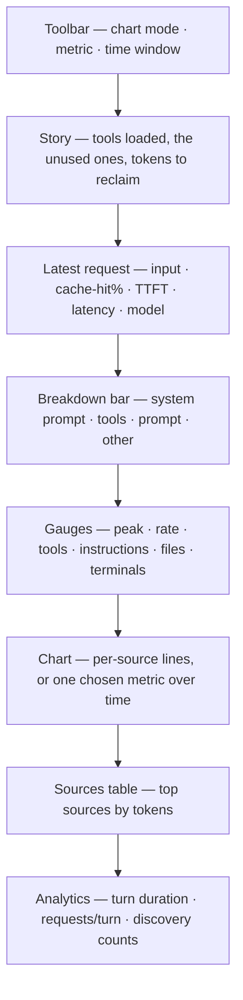

# Dashboard, metrics, and sidecar plan

This document captures three things the current dashboard is missing:

1. **New metrics** we can compute from data we already read but don't surface.
2. **The sidecar decomposition** — turning one opaque `inputTokens` number into an
   honest stacked breakdown (system prompt / tools / history / files / prompt).
3. **The dashboard architecture question** — is this a standard, extensible dashboard,
   and what we'd fix to make it one.

Everything below is grounded in what the real Copilot debug logs actually expose. No
guessed provider internals.

## The system, running

What happens on each Copilot request, end to end:

```mermaid
sequenceDiagram
  actor U as You
  participant C as Copilot Chat
  participant L as Debug logs
  participant T as Tailer
  participant E as Rust engine
  participant D as Dashboard
  U->>C: Send a prompt or run an agent task
  C->>L: Write llm_request span + system/tools sidecars
  T->>L: Tail the newest session
  T->>E: recordRequestSnapshot(inputTokens, ttft, cacheHit)
  E->>D: metrics + request breakdown + tool fix
  D-->>U: Chart moves; Story flags unused tools
```

The panel renders as a top-to-bottom stack of cards (order and visibility are set by the
`contextTop.dashboardLayout` setting):



> **Screenshots:** drop real captures of the running panel in `docs/media/` and embed them
> here with Markdown image syntax (pointing at `media/<file>.png`) once you have a
> representative session to show.

---

## 1. Current dashboard: what it is today

The panel was a **bespoke renderer** and has since been made **data-driven and
user-extensible** (see [§4.2](#42-dashboard-architecture-and-extensibility)):

- HTML/CSS/JS is still generated in [`getHtml`](../apps/vscode/src/extension.ts), but the
  visible cards are now driven by a **layout list** and a **series registry**, not
  hard-coded order.
- The chart is drawn on a raw `<canvas>` behind a `SERIES` abstraction — adding a source
  kind is one array entry that the chart, legend, and table all pick up.
- Users choose which cards show and in what order via the
  `contextTop.dashboardLayout` setting; a typed [`DashboardEvent`](../apps/vscode/src/dashboardContract.ts)
  is the single, documented data channel to the UI.

---

## 2. New metrics we can add

All of these are **observed** from `main.jsonl` spans or the sidecar files unless marked
otherwise. Confidence labels follow [`METRICS.md`](arch/METRICS.md#metric-meaning).

### 2.1 Per-request (from `llm_request` spans)

- [x] **Time to first token** (`attrs.ttft`) — model responsiveness, observed.
- [x] **Cache-hit %** (`cachedTokens / inputTokens`) — the #1 cost signal; low reuse ≈
      wasted spend.
- [x] **Uncached tokens** (`inputTokens − cachedTokens`) — the part paid at full price.
- [x] **Context growth per turn** (Δ `inputTokens` between consecutive requests).
- [x] **Budget utilization %** — `inputTokens` vs the model's real context window from
      `models.json` `capabilities` (observed budget, not a guessed window).
- [x] **Output tokens** (`outputTokens`).
- [x] **Request config** — `maxTokens`, `temperature`, `topP`.
- [x] **Message count** (`requestShape.messageCount`) and API shape (`requestShape.api`).
- [x] **Real billing units** (`copilotUsageNanoAiu`).
- [x] **Request outcome** — success / failure / cancel derived from span `status` +
      error attrs.
- [x] **Model latency** (span `dur`).
- [x] **Response id** (`responseId`) — correlation key for a request.

### 2.2 Per-turn / session

- [x] **Turn duration** (`turn_end.ts − turn_start.ts`, matched by `turnId`).
- [x] **Requests per turn**.
- [x] **Tool calls per turn**.
- [x] **Session duration** and **total turns**.
- [x] **Environment** — `copilotVersion`, `vscodeVersion` (from `session_start`).

### 2.3 Tool metrics (from `tool_call` spans)

- [x] **Tool-call count**, **per-tool latency** (p50/p95), **failure rate**.
- [x] **Tool-result payload size** (via `Hooks.log`).
- [x] **Breakdown by tool name**.

### 2.4 Discovery / hidden context pressure (from `discovery` spans)

- [x] **Count of agents / skills / instructions / slash commands / hooks actually
      loaded** — real hidden context that inflates the request.
- [x] **Resolve latency per category** (ms) — parsed from the discovery span text.

### 2.5 Operation breakdown (`attrs.debugName`)

- [x] **Cost per internal operation** — e.g. `summarizeVirtualTools` vs the main turn —
      grouped by `debugName` (breakdown table + per-request note).

### 2.6 Correlations / anomalies (derived, labeled as statistics not measurements)

- [x] **Input-tokens ↔ latency correlation** (Pearson, computed in
      `copilotAnalytics.ts`).
- [x] **Slowest-request outlier** (mean + 2σ).
- [x] **Cache-ratio volatility** flag.

> Many of these distributions are **already computed** in
> [`copilotAnalytics.ts`](../apps/vscode/src/copilotAnalytics.ts) (`ttftMs`,
> `cacheHitRatio`, `contextChangeTokens`, `operations`, `tools`, correlation) but are not
> all rendered. Surfacing them is largely a UI task, not new parsing.

---

## 3. The sidecar decomposition (the big win)

### 3.1 What the sidecars are

Each debug-log session folder holds companion files that `llm_request` spans reference
**by name** instead of inlining:

| Sidecar file | Referenced by | Contains |
| --- | --- | --- |
| `system_prompt_N.json` | `attrs.systemPromptFile` | Full system prompt text for that request |
| `tools_0.json` | `attrs.toolsFile` | Full tool schemas actually shipped to the model |
| `models.json` | (session-wide) | 56 models with `capabilities`, `billing`, price category |

### 3.2 Why they matter

Today the dashboard shows `inputTokens` (~100–180k) as **one opaque blob**. But that
number is really:

```text
inputTokens = system prompt + tool schemas + history + files/selection + user prompt
```

The sidecars let us decompose it honestly:

- Tokenize `system_prompt_N.json` → **exact system-prompt cost** (large and mostly fixed).
- Tokenize `tools_0.json` → **exact tool-schema cost** — the product's whole thesis
  ("tools are eating your context"), measured instead of estimated from
  `vscode.lm.tools`.
- `models.json` `capabilities` → **real context window**, so the budget line becomes
  observed, not guessed.

This turns the single `inputTokens` bar into a **stacked breakdown** matching the source
palette in [`METRICS.md`](arch/METRICS.md#source-categories).

### 3.3 How it is wired

1. **Resolve** `systemPromptFile` / `toolsFile` relative to the active session dir
   (basename-only; no path traversal).
2. **Tokenize once per filename** and cache by `path:size`; attribute the token cost to
   the request that references it.
3. **Attribute to the request view, not the ambient gauge.** The decomposition is shown
   in the request breakdown card (system prompt / tools / prompt / other). It is
   deliberately **not** ingested as ambient `instructions`/`tools` candidates — that
   would double-count against the observed `inputTokens` and the real ambient collectors,
   violating the candidate-vs-confirmed separation in
   [`METRICS.md`](arch/METRICS.md#metric-meaning).
4. **Budget**: read `models.json` `capabilities.limits` for the active model
   (`max_prompt_tokens`, else `max_context_window_tokens`) and show input as a percentage
   of it — an observed budget, not a guessed window.
5. **Privacy**: sidecar text is processing input only — tokenize then drop the buffer,
   per the [storage/retention contract](arch/METRICS.md#storage-and-retention). Never persist
   raw prompt or tool text.

---

## 4. Things to fix

### 4.1 Data / metrics gaps

- [x] Surface the already-computed analytics distributions (TTFT, cache ratio, context
      change, operation/tool breakdowns) that are collected but not rendered.
- [x] Decompose `inputTokens` via sidecars (§3) instead of showing one opaque total.
- [x] Replace the guessed/absent budget with the observed `models.json` context window.
- [x] Add discovery-based hidden-context counts (agents/skills/instructions/hooks loaded).
- [x] Add real cost (`copilotUsageNanoAiu`) and per-operation (`debugName`) breakdowns.
- [x] **Metric selector on the chart** — Request mode has a dropdown to plot **All
      metrics** (default; every per-request metric overlaid, each normalized to its own
      max), **Composition**, or a single metric in real units (input, budget %, cache
      hit %, uncached, context growth, TTFT, latency, output, billing). Legend shows live
      values.
- [x] **Chart mode toggle** — Candidate (ambient gauge, streaming lines) vs Request
      (**one line per context item** over time — system prompt / tools / prompt / other —
      with dots per request and the model **budget line**; requests over budget get a red
      dot). Auto-switches to Request on the first observed request so the rich multi-line
      view is the default, until the user picks a mode.

### 4.2 Dashboard architecture and extensibility

The bespoke canvas has been made data-driven:

- [x] **Panel/card model** — each dashboard block carries a `data-card` id; the webview
      shows and orders cards from a layout list instead of fixed markup.
- [x] **User-extensible layout** — `contextTop.dashboardLayout` chooses which cards show
      and in what order; changes apply live without reload.
- [x] **Charting series abstraction** — a `SERIES` registry drives the chart, legend, and
      source table; adding a source kind is one array entry (CSP-friendly, no new dep).
- [x] **Stable event contract** — [`DashboardEvent`](../apps/vscode/src/dashboardContract.ts)
      is the single typed `metrics` message an alternative front-end can consume.

> A full third-party charting library was intentionally **not** adopted — the series
> abstraction keeps the CSP-nonce webview dependency-free while still making new series
> and distributions cheap to add.

---

## 5. The story: prune tools you don't use

The measurement exists to drive an action. The **Story card** turns the numbers into a
plain-English narrative and a lever. See [`TOOL_STORY.md`](TOOL_STORY.md) for the full,
cross-referenced write-up; in brief:

- Joins per-tool schema cost (`vscode.lm.tools`, tokenized) with the tools Copilot
  **actually invoked** this session (`tool_call` span names).
- Headline: *"N tools loaded · Xk tokens (~Y% of last request)."*
- Detail: which tools were called, and how many loaded tools **weren't** — with the
  token savings from turning them off.
- Ranked list of the biggest **unused** tools (the clearest cut candidates).
- **Manage tools…** action opens VS Code's tool configuration (or guides to the Chat
  Tools picker).

Real-log finding that motivates this: the tools Copilot invoked were built-ins
(`file_search`, `list_dir`, `manage_todo_list`), while the ~24k-token schema load is
mostly **extension/MCP tools that went uncalled** — dead weight on every request.

### Per-call tool toggling (feasibility)

- **Automatic per-call on/off is not exposed to extensions.** VS Code's `vscode.lm.tools`
  is read-only; there is no API to enable/disable another extension's tool for standard
  Copilot chat. Copilot already does server-side reduction via *virtual tools* grouping
  (seen as `debugName: summarizeVirtualTools`).
- **What contextTop can do:** measure cost vs. usage, recommend cuts, and route the user
  to the Tools picker / tool sets to disable unused tools (persisted, not per-call).
- **AI-assisted (future):** for a given prompt, an LLM could suggest a minimal tool
  subset; contextTop would still only *recommend* — the user (or a tool set) applies it.
  This stays a recommendation, never a silent mutation of Copilot state.
