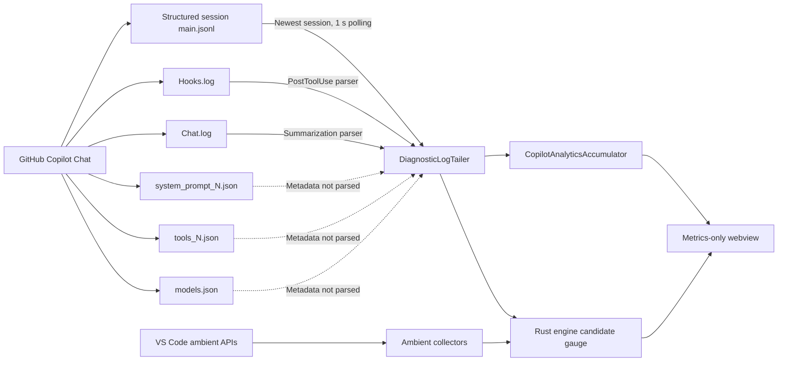

# contextTop — Current Review and Copilot Log Analysis

> Reviewed: 2026-09-05  
> Audience: maintainers and implementation agents  
> Scope: current Rust engine, VS Code extension, specifications, and locally available
> GitHub Copilot diagnostic logs. Historical findings that no longer match the code are
> listed only in the resolved appendix.

## Executive assessment

The current prototype has a sound privacy-oriented domain model and a useful live
request analytics panel. Provider-reported request tokens, cache usage, latency, TTFT,
model, operation, tool activity, and outcomes are available from the observed structured
session logs.

It is not ready to describe its primary chart as accurate request context pressure.
Two correctness defects dominate:

1. Provider-reported request `inputTokens` are inserted into the ambient candidate
   gauge, where they are summed with files, tools, instructions, selections, and tool
   results. This mixes confirmed aggregate request input with candidate estimates.
2. Candidate identities have no removal or expiry path. Closed files, removed tools,
   deleted instructions, and old tool results can remain in the gauge indefinitely.

Diagnostic ingestion is also running ahead of its documented validation gate. The
current parser is useful for development research, but it is not yet version-pinned,
cross-platform validated, deduplicated, or protected by parser-health telemetry.

## Current architecture

The extension starts one Rust child process and performs a JSONL-over-stdio handshake.
Ambient collectors send candidate observations for selections, loaded text documents,
instruction files, and loaded tool schemas. The diagnostic tailer can additionally read:

- The newest Copilot `debug-logs/<session>/main.jsonl` from global storage.
- `GitHub Copilot Chat Hooks.log` for tool-result sizes.
- `GitHub Copilot Chat.log` for summarization token usage.
- Other JSON/OTLP/log files in the Copilot extension-log directory through a generic
  recursive token-field scanner.

`main.jsonl` is described here as **structured span JSONL**. Its records are span-like,
but this review does not claim that the file itself conforms to a standard OTLP export
schema.

The newest structured session is backfilled from byte zero, then tailed by byte offset.
Switching session files resets the request analytics. Numeric sample arrays retain at
most 500 values; event counters and named breakdown maps are not globally capped by that
limit.

## Evidence scope

The analysis used metadata only. Prompt text, responses, reasoning, tool arguments,
tool results, and source content were not retained or reproduced.

### Full source inventory

- Global debug-log root: **11 session directories, 88 events, 3.43 MiB of
  `main.jsonl` data**.
- Four global sessions contain request activity; seven contain only startup metadata.
- Workspace-scoped root: **6 session directories and 6 startup-only events**.
- Across both roots: **17 directories and 94 events**.
- Global event integrity: zero malformed JSONL lines and **35/35 resolved parent links**.
- All 8 request references point to existing system-prompt and tool snapshots.
- All observed statuses are `ok`; this sample does not validate error record shapes.
- Producer versions in the sample: Copilot `0.64.1`, VS Code `1.136.1`.
- The `v` field appears only on session-start records in this sample and must not be
  required on every event.

### Statistical cohort

Request distributions use only the **four sessions containing request activity**:
**81 events, 5 user messages, 8 turns, 8 model requests, and 8 tool calls**. Startup-only
sessions are excluded from request distributions but included in the source inventory
above.

Companion-file inventory covers the same data root:

- Four system-prompt snapshots: 48,156 bytes each and four distinct hashes.
- Four tool snapshots: 130,491 bytes each, one shared hash, 121 tool definitions.
- Eleven model catalogs: 91,955 bytes each and one shared hash.

Equal prompt-file sizes with different hashes demonstrate that byte size alone cannot
establish prompt stability.

## Observed request results

All observations below are descriptive statistics for a small, single-model sample.
They do not establish production reliability or causality.

### Outcomes

- Model requests: **8/8 successful**.
- Tool calls: **8/8 successful**.
- Recorded cancellations: **0**.
- Explicit retries: **0**.
- Model: `claude-opus-4.8` for all 8 requests.

### Latency

| Metric | n | p50 | p95 | Maximum | Mean | Population σ |
| --- | ---: | ---: | ---: | ---: | ---: | ---: |
| Request duration | 8 | 4.111 s | 5.023 s | 5.198 s | 3.982 s | 0.759 s |
| Time to first token | 8 | 1.632 s | 2.202 s | 2.377 s | 1.700 s | 0.325 s |
| Tool execution | 8 | 5.5 ms | 23.3 ms | 24 ms | — | — |

The percentiles are interpolated descriptions of these eight observations, not stable
tail estimates. Operational alerts should not use p95/p99 until a configured minimum
sample size is met.

### Input and cache behavior

| Metric | n | Minimum | p50 | p95 | Maximum | Mean | Population σ |
| --- | ---: | ---: | ---: | ---: | ---: | ---: |
| Provider-reported input tokens | 8 | 105,679 | 142,384 | 179,859 | 179,930 | 142,606 | 36,925 |
| Cache-hit ratio | 8 | 12.26% | 35.64% | 99.87% | 99.89% | 50.95% | 40.66 pp |

Each observed cold first request contained about 105.7k input tokens with 12.3% cached.
In the five-request session, cache hit increased from 12.3% to 59.0%, then approximately
99.8% for requests 3–5. Input grew by 73,402 tokens between requests 1 and 2, followed
by changes of 295, 347, and 203 tokens.

These fields describe provider-reported model input and cache accounting. They do not
identify which context items were selected, whether those items were relevant, or
whether the model used them.

### Correlations and anomalies

- Input tokens versus request duration: Pearson $r=0.223$, $n=8$. This is weak
  association in a tiny single-model cohort, not evidence of causation.
- `copilotUsageNanoAiu` versus uncached input tokens: Pearson $r=0.9989$, $n=8$.
  The unit is undocumented and must remain an opaque provider-usage quantity, never a
  currency estimate.
- The 46.55-second five-request session is longer than the median session duration of
  5.85 seconds because it contains the only multi-request tool loop; this is not by
  itself an error.
- The largest request-to-request input change is 73,402 tokens.
- Cache behavior is bimodal. Segmenting cold and warm requests is more informative than
  reporting only the overall mean.

## Metric catalog

Measurement uses the product values **Observed**, **Estimated**, or **Unknown**.
“Derived statistic” below describes aggregation, not a fourth measurement value.

| Signal | Metric | Measurement | Inclusion | Coverage and limitation |
| --- | --- | --- | --- | --- |
| Editor selection | Byte-based fallback token count | Estimated | Candidate | Complete for the sampled range; 120 ms debounce |
| Loaded text documents | Byte-based fallback token count | Estimated | Candidate | All loaded file documents, not confirmed request attachments |
| Instruction files | Byte-based fallback token count | Estimated | Candidate | Per discovered file; search limits can make aggregate coverage partial |
| Loaded tool schemas | Serialized-size fallback tokens | Estimated | Candidate | Loaded does not mean sent or invoked |
| Terminal inventory | Terminal count | Observed | Not applicable | No terminal-content token metric |
| Hook tool result | Response-size fallback tokens | Estimated | Candidate | Tool result observed; later request inclusion unknown |
| Summarization call | Provider prompt tokens | Observed | Stored as Candidate | Describes a summarization call, not general chat-history composition |
| Model request | Input/output/cache tokens, TTFT, duration, model, operation | Observed | Stored as Candidate incorrectly | Confirmed aggregate call; no per-source composition |
| Request outcomes | Status-derived counts | Observed | Not applicable | Only successful records validated locally |
| Request distributions | Statistics from observed fields | Observed inputs | Not applicable | Numeric series retain the latest 500 samples per active session |
| Context churn | Absolute input-token delta | Observed inputs | Confirmed aggregate call | Cannot identify changed sources |
| Error categories | Bounded classification | Observed inputs | Not applicable | Free-form `attrs.error` is intentionally ignored |
| Correlation | Pearson statistic | Observed inputs | Not applicable | Association only; suppress for insufficient samples |

### Context funnel coverage

| Stage | State | Evidence |
| --- | --- | --- |
| Requested | Unknown | No requested-item or requested-token field |
| Found | Unknown | Discovery records describe customization loading, not retrieved context items |
| Selected | Unknown | No selection-decision or reason fields |
| Sent | Observed aggregate | Provider-reported `inputTokens` |
| Used | Unknown | No utilization, citation, attention, or relevance evidence |

## Current findings

### P0 — Request totals are mixed into candidate pressure

[`DiagnosticLogTailer.parseMainSpan`](apps/vscode/src/diagnosticLog.ts) sends each
request's observed `inputTokens` through `request.ingestObservation` as a `prompt`
candidate. The Rust engine then sums that value with ambient candidates. This violates
the documented separation between candidate pressure and immutable request evidence and
can double count files, tools, instructions, and selections.

**Required correction:** add a dedicated observed request-series or snapshot path. Do
not place aggregate request input in the candidate gauge. Keep confirmed aggregate input
separate from any per-source composition.

### P0 — Candidate sources become stale

The engine replaces observations sharing a source key, but there is no removal or expiry
operation. Rescanning only re-ingests sources that still exist. Consequently, closed
documents, removed tools, deleted instruction files, and uniquely keyed historical tool
results can remain in the total.

**Required correction:** define source removal/tombstone semantics and bounded expiry.
Each collector must reconcile its previous and current key sets. Ephemeral tool results
need request/session ownership rather than indefinite candidate lifetime.

### P0 — Unvalidated diagnostic schemas are consumed

[`docs/SIGNALS.md`](docs/SIGNALS.md) requires a version-pinned, cross-platform validation
gate before diagnostic ingestion. The extension currently parses structured and raw logs
in Development mode automatically and whenever `contextTop.enableDiagnosticLogs` is on.
The generic recursive token-field scanner is especially permissive.

**Required correction:** ship strict per-event allowlists and sanitized fixtures for
supported Copilot/VS Code versions. Unsupported versions and missing fields must produce
`Unknown`. Remove or quarantine generic recursive extraction after schema validation.

### P0 — `captureLevel: off` is not enforced

The setting is forwarded through `request.setConfig`, but the engine stores it only as
opaque configuration. Ambient collectors and diagnostic ingestion continue, and live
candidate state is not cleared.

**Required correction:** when capture is off, stop collectors/tailers, reject or ignore
new ingest requests, clear live gauges, and purge persisted data when storage exists.

### P1 — Diagnostic consent and lifecycle are fragmented

Copilot log production and contextTop log consumption use separate settings. The
first-run prompt enables only the producer setting, while the tailer is constructed only
during activation. Runtime setting changes update button state but do not start or stop
the tailer.

The observed global session logs existed independently of the workspace-scoped source;
this review does not claim that the Agent Debug Log toggle caused their creation.

**Required correction:** provide one disclosure-driven flow that explains both settings,
starts and stops ingestion dynamically, and reports producer, consumer, and schema
health separately.

### P1 — Engine restart violates session/key identity expectations

`EngineClient` allocates one session ID in its constructor and reuses it when restarting
the child. A restarted Rust engine creates a new HMAC key under that same session ID.
The specification states that an engine restart starts a new session and key.

**Required correction:** allocate a new session ID and nonce for every child spawn, then
repeat configuration and subscription setup.

### P1 — Historical storage and streaming are placeholders

The Rust engine is memory-only. `getTimeline` emits one synthetic current-state bucket,
and `subscribeMetrics` always returns snapshot mode without replay. SQLite persistence,
rollups, cleanup, checkpoints, and bounded replay are not implemented.

**Required correction:** implement the documented bounded storage and sequence model
before presenting charts as retained history. Resolve how old session IDs are selected
by history queries and include lifecycle/fix/export-spool records in deterministic
retention rules.

### P1 — File polling can block and duplicate work

The tailer performs synchronous filesystem operations every second. An appended file can
allocate its entire unread remainder, and generic candidate files are reread from byte
zero after each size change. Instruction-file discovery also runs every five seconds.

**Required correction:** cap each read and carry buffer, track file identity as well as
size, process bounded chunks, debounce scans, add retry backoff, and avoid full rescans.

### P1 — Analytics updates are more expensive and less bounded than stated

After every structured event—including backfill—the extension recomputes distributions,
sorts retained arrays, and posts the full analytics snapshot. The 500-value cap applies
to numeric series, not all counters or named maps.

**Required correction:** aggregate once per poll or animation frame, bound dimension
cardinality, expose the retained sample/time window, and mark truncated coverage as
partial.

### P1 — Capabilities overstate implemented collectors

The hello handshake advertises `signals.terminalShellExecution` and
`signals.participant`. The current extension records only terminal inventory and has no
chat participant contribution or adapter snapshot wiring.

**Required correction:** advertise only implemented capabilities. Add participant and
terminal-execution capabilities when their real collectors are active.

### P2 — Documentation and packaging cleanup

- Product and architecture docs still promise a status-bar surface that was removed.
- The contributed view is `ContextTop Fix`; project copy generally uses `contextTop Fix`.
- `Cargo.toml` declares MIT but the repository has no `LICENSE` file.
- The standalone `outputs/contextTop/` mock presents competing semantics and should be
  clearly archived or removed.
- The exact source-key wire codec should be stated in IPC docs: lowercase hexadecimal of
  the full 32-byte HMAC-SHA-256 digest, with no prefix.

## Safe metrics available but not yet captured

- Request message count from request-shape metadata, useful for history-growth analysis.
- `spanId`, `parentSpanId`, and `responseId` for deduplication and request timelines.
- Opaque `copilotUsageNanoAiu`, with no monetary interpretation.
- Referenced system-prompt/tool snapshot byte sizes, hashes, and tool counts.
- Selected-model prompt/output limits from `models.json`, clearly distinguished from a
  validated usable budget.
- Parser health: files discovered, records seen/accepted/rejected, schema mismatches,
  duplicate suppression, read lag, active root/session, and last successful parse.

The observed selected model advertises `max_prompt_tokens: 936000` and
`max_output_tokens: 64000`. Request `maxTokens: 64000` is therefore an output setting,
not the prompt budget. Observed input was approximately 11.29%–19.22% of the catalog's
maximum prompt value, but that catalog maximum must not be presented as an observed
usable budget without validation.

## Metrics requiring upstream instrumentation

Current logs cannot reliably provide:

- Context requested, found, selected, and used counts.
- Per-request context-item identities and source composition.
- Selection reasons and retrieval duration.
- Truncation or rejection counts and reasons.
- Relevance, citation, attention, or other use signals.
- Retry reasons and fallback-model decisions.
- Response-delivery duration.
- A validated usable prompt budget.

These values must remain `Unknown`; token deltas and repeated model calls are not valid
substitutes.

## Privacy assessment

Copilot's source debug files contain sensitive raw prompts, message arrays, responses,
reasoning, tool inputs/results, and complete system/tool definitions. In the observed
roots they occupy more than 5 MiB. contextTop currently derives metadata transiently and
sends metrics-only webview payloads, but enabling source logging creates those raw files
independently of contextTop's future database retention policy.

Before release, the consent UI should disclose the raw source directory and retention
implications, show age/size without exposing content, offer safe cleanup guidance, and
avoid logging absolute paths by default. Parser exceptions and diagnostics must never
serialize whole source records.

## What remains in the roadmap

contextTop is currently a useful development prototype, not a completed Phase 1
product. The engine model and live panel exist, but the end-to-end product loop is not
yet complete:

Today, only the first step and part of the second are visible. Candidate observations
reach the engine, and structured logs provide aggregate request analytics, but those two
paths are incorrectly combined in the candidate total. Recommendations exist only in
the engine; the extension does not request, render, apply, or verify them. Historical
storage and request lifecycle streaming are placeholders.

### Phase 1 — make the local product truthful and complete

#### Correctness gate

1. Separate aggregate request totals from ambient candidate pressure.
2. Remove or expire candidate sources that are no longer present.
3. Enforce `captureLevel: off` across collection, engine state, and future persistence.
4. Fix engine-restart session identity and restore configuration/subscriptions safely.
5. Send `transientContent` under the correct camelCase wire field and enforce the
  documented 64 KiB preprocessing boundary.
6. Advertise only capabilities backed by active collectors.

#### Core completeness

1. Wire participant-owned `recordRequestSnapshot` calls from the extension.
2. Implement request lifecycle ingestion and exact request markers.
3. Replace the one-bucket timeline and snapshot-only subscription with sequenced events,
  bounded replay, stream-gap recovery, and real historical buckets.
4. Implement bounded SQLite persistence, migrations, cleanup, rollups, checkpoints, and
  no-raw-content tests.
5. Package a host-architecture engine binary instead of spawning `target/debug/engine`.
6. Wire `getRecommendations` into an explicit-confirmation, reversible adapter flow and
  verify outcomes against later requests.

#### Panel and verification

1. Render the already-collected per-tool audit details and correlate invocations when
  request evidence exists.
2. Render instruction-file audit details and collect the missing recentness metadata.
3. Add per-value Measurement × Inclusion × Coverage labels and statistically honest
  sample-window behavior.
4. Run the complete F5 test after the blockers above—not before—and verify candidate
  totals, separate request metrics, source removal, diagnostics controls, recovery, and
  privacy behavior.

Phase 1 is done only when a developer can distinguish candidate pressure from a real
request, receive and explicitly apply a reversible recommendation, verify its effect on
a later request, and revisit bounded history without raw content being retained.

### Diagnostics validation gate

Diagnostics should not be treated as shipped Phase 1 functionality. Before release:

1. Decide which structured source is authoritative and document how it is enabled.
2. Pin filenames, extension identity, Copilot versions, VS Code versions, and accepted
  fields.
3. Add sanitized fixtures for valid, malformed, truncated, rotated, and unknown-version
  records.
4. Validate macOS, Windows, and Linux with at least five requests per supported setup.
5. Add deduplication and parser-health metrics.
6. Prove raw prompts, responses, paths, terminal text, and unknown fields never reach
  persistence, export, webview messages, or logs.
7. Leave unsupported signals `Unknown` and keep the adapter disabled when the gate is
  incomplete.

### Phase 2 — Copilot workflow

Phase 2 cannot start from the assumptions in `phase-2-prompt.md` until Phase 1 actually
meets its exit criteria. Its atomic deliverables are:

1. `@contexttop /fix` preflight using only participant-visible prompt, references,
  attached tools, and selected model.
2. Streamed ranked guidance backed by a confirmed participant snapshot.
3. Guided or participant-owned clean-chat handoff summaries.
4. The validated, explicitly enabled diagnostic adapter.
5. Tool inventory, invocation, and result accounting correlated to request lifecycle.
6. Bounded declarative `contextTop.modelTokenizerMappings` configuration.
7. Bounded declarative `contextTop.redactionRules` that cannot weaken built-in rules.

Phase 2 is done when preflight guidance streams through the participant and the bottom
panel follows request lifecycle with honest quality labels.

### Phase 3 — desktop and enterprise

The implementation plan reserves these later deliverables:

- Tauri desktop companion reusing the Rust engine and a shared UI.
- Optional aggregate-only team service.
- Organization policy and tenant isolation.
- Splunk HEC export with a bounded delivery spool.
- Signed releases, updates, telemetry opt-in, and enterprise deployment documentation.

None of Phase 3 is represented by working code or atomic tasks yet. It should remain a
future milestone until the local workflow is complete.

### Planning documents that need reconciliation

- [`docs/IMPLEMENTATION_PLAN.md`](docs/IMPLEMENTATION_PLAN.md) and
  [`run-to-testable-prompt.md`](run-to-testable-prompt.md) still require a status bar,
  although the user explicitly removed that surface.
- The plans say diagnostics remain disabled until validation, while current development
  hosts auto-enable the unvalidated parser and installed builds can opt into it.
- [`phase-2-prompt.md`](phase-2-prompt.md) assumes Phase 1 storage, snapshots, streaming,
  and reversible fixes are complete; they are not.
- Several completed-task descriptions preserve historical wording such as “OTLP spans”
  and “full context sent.” They are implementation history, not current guarantees.
- The old run-to-testable definition is therefore not the current Phase 1 exit gate. The
  corrected F5 verification scope is tracked in [`TASKS.md`](TASKS.md).

## Recommended implementation order

1. Separate observed request totals from candidate state.
2. Add candidate removal, reconciliation, and expiry semantics.
3. Enforce `captureLevel: off` across adapter and engine.
4. Replace generic extraction with strict, versioned parsers and fixtures.
5. Add deduplication and parser-health metrics.
6. Unify diagnostic consent and runtime start/stop behavior.
7. Correct engine restart session identity and capability advertising.
8. Attach Measurement × Inclusion × Coverage metadata and minimum-sample rules to
   dashboard values.
9. Parse approved companion metadata without retaining content.
10. Add request timelines, bounded persistence, rollups, and replay.
11. Request first-party context-funnel and relevance instrumentation.

## Validation status

- TypeScript compilation: passed in the current workspace.
- Rust tests: 46 passed in the latest recorded full run.
- Report diagnostics: zero Markdown errors after this rewrite.
- Local Markdown link scan: zero broken links after this rewrite.
- `git diff --check`: passed after this rewrite.
- Manual F5 extension-host verification: still pending in [`TASKS.md`](TASKS.md).
- Diagnostics validation gate: still pending and must not be represented as complete.

## Resolved historical findings

The following findings appeared in older review passes but no longer describe the
current implementation:

- The status-bar item with an unlabeled context value and fake `74%` budget was removed.
- The webview now has a nonce-based CSP and calls `acquireVsCodeApi()`.
- Measurement, inclusion, and coverage are separate Rust enums.
- The additive prototype state model was replaced by a source-keyed replacement gauge.
- Token counts use `u64`.
- HMAC source keys, immutable request snapshots, protocol modules, the engine binary,
  redaction, tokenization, and rank-only recommendation contracts now exist.
- The unknown `usableBudgetTokens` example no longer sends `null`.
- Ambient raw path labels and mock Fix buttons are absent from the current webview.
- Remote clock semantics are now documented as extension-host/engine-host time.

This appendix records resolution only; these items are not active defects.
